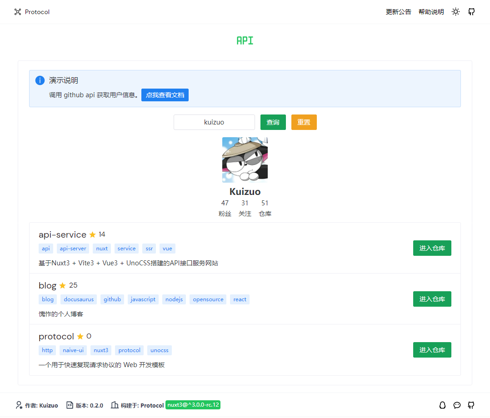

<p align="center">
  
</p>

<p align="center">
  <i>Artwork from <a href="https://nuxt.com/">Nuxt</a></i>
</p>

<h1 align="center">Protocol</h1>
<p align="center">🧪 一个用于快速复现请求协议的 Web 开发模板。</p>

<p align="center">
<a href="https://protocol.kuizuo.cn">🖥 Online Preview</a>
<br><br>
<a href="https://stackblitz.com/github/kuizuo/protocol"></a>
</p>
<p align="center">
  <a href="https://www.npmjs.com/package/nuxt/v/rc"></a>
  <a href="https://img.shields.io/github/languages/code-size/kuizuo/protocol"></a>
  <a href="https://github.com/kuizuo/protocol/actions/workflows/ci.yml"></a>
  <a href="https://github.com/kuizuo/protocol/tree/HEAD/LICENSE"></a>
</p>
<p align="center">
  <a href="https://kuizuo.cn/protocol-template" alt="protocol-template" >
    
  </a>
</p>

## ✨ 目的

如果你恰好使用 Node.js 来请求api接口或者爬虫，并且部署在 Web 上，那么基于本模板将会特别容易做到。

## 🚀 快速开始

```
git clone https://github.com/kuizuo/protocol
cd protocol
pnpm i
pnpm run dev
```

- 将 public/logo.svg 换成你想要展示的 logo
- 修改 [app.config.ts](https://v3.nuxtjs.org/guide/directory-structure/app.config/) 中的配置（标题，描述），并通过 `useConfig()` 获取配置
- 在 content 目录下修改 `help.md` 与 `changelog.md` 以更新使用说明与更新日志。支持 [MDC Syntax](https://content.nuxtjs.org/guide/writing/mdc/)
- 在 server/api 下编写你的后端请求接口。在 server/protocol 下编写协议请求核心逻辑便于调用
- 在 [nitro.config.ts](https://nitro.unjs.io/guide/introduction/storage) 配置数据存储位置，并使用 `useStorage()` 来存取数据，得益于[unjs/unstorage](https://github.com/unjs/unstorage)
- 前端使用 [ohmyfetch](https://github.com/unjs/ohmyfetch) 来请求后端接口，有完善的接口类型提示

## 🎉 部署

### 服务器

这里使用 pm2 进行部署，创建 `ecosystem.config.js` 文件：

```js
module.exports = {
  apps: [
    {
      name: 'Protocol',
      exec_mode: 'cluster',
      instances: '1',
      env: {
        NITRO_PORT: 8010,
        NITRO_HOST: '127.0.0.1',
        NODE_ENV: 'production',
      },
      script: './.output/server/index.mjs',
    },
  ],
}
```

接着执行 `pm2 start ecosystem.config.js` 即可。

### Vercel

转到 [Vercel](https://vercel.com/new) 并选择你的项目，点击  "Deploy"，您的应用程序将在一分钟内上线。

### Netlify

转到 [Netlify](https://app.netlify.com/start) 并选择您的项目，点击 "Deploy site"，您的应用程序将在一分钟内上线。

## 🖥️ 演示



## 

## 🤝 免责声明

**本模板仅仅是web模板，任何开发者用该模板编写任何站点都与本人无关。本项目仅作为个人技术专研，仅供学习参考。**

## 📝 License 

[MIT](./LICENSE) License &copy; 2022-PRESENT [Kuizuo](https://github.com/kuizuo)
